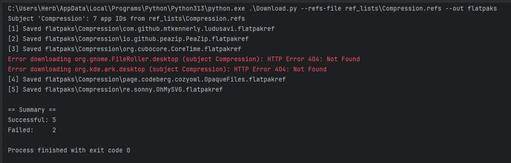

# Flathub Refs Toolkit

[](#)
[](#)

“Flathub Refs Toolkit — generate and download .flatpakref descriptor lists directly from Flathub’s AppStream metadata.”

This repository contains two small utilities:
- Query.py — builds .refs files by reading Flathub AppStream, grouped by category.
- Download.py — downloads .flatpakref files for every app ID found in one or more .refs files.

## Requirements
- Python 3.9+
- No third‑party dependencies (uses the Python standard library)

## Ref format
Each line in a .refs file is a Flatpak reference in the form:

```
app/<app_id>/<arch>/<branch>
```

Example:
```
app/org.mozilla.firefox/x86_64/stable
```

## Installation
- Clone this repository.
- Optionally create and activate a virtual environment.
- No extra packages are required.

## Usage
Below examples use Windows PowerShell. Adjust paths as needed.

### 1) Generate .refs files (Query.py)
Print category counts only:
```powershell
python .\Query.py --dump-categories
```


Generate refs for specific categories into the refs\ directory:
```powershell
python .\Query.py -c Compression --out ref_lists
python .\Query.py -c WebBrowser --out ref_lists
```

Generate refs for all categories (one .refs per category):
```powershell
python .\Query.py --all --out ref_lists
```

Merge multiple categories into a single file:
```powershell
python .\Query.py -c WebBrowser -c Development --merge-to Browsers+Dev.refs --out refs_merged
```

Change architecture/branch (defaults: x86_64, stable):
```powershell
python .\Query.py -c Development --arch aarch64 --branch stable --out refs-aarch64
```

### 2) Download .flatpakref files (Download.py)
From a single refs file into flatpakrefs\<subject>\:
```powershell
python .\Download.py --refs-file ref_lists\Compression.refs --out flatpaks
```


From all .refs files in a directory:
```powershell
python .\Download.py --refs-dir ref_lists --out \refs_downloads
```

Combine multiple refs files explicitly:
```powershell
python .\Download.py -f refs\WebBrowser.ref_lists -f refs\Development.refs --out out
```

### Quick Start
```
git clone https://github.com/APTlantis/Bulk-Flatpak-Refs.git
cd Bulk-Flatpak-Refs
python Query.py --all --out ref_lists
python Download.py --refs-dir ref_lists --out flatpaks
```

Useful options:
- --throttle <seconds>  Add a small delay between downloads to be gentle on servers.
- --limit <N>           Stop after N successful downloads (0 = no limit).
- --no-skip-existing    Overwrite existing .flatpakref files (default behavior is to skip existing files).

Output layout:
- When multiple .refs are processed, downloads are organized into per-subject subfolders under --out, where the subject is the .refs filename without extension. Example: refs\WebBrowser.refs -> out\WebBrowser\org.mozilla.firefox.flatpakref

Notes:
- These tools download only the tiny .flatpakref descriptor files, not the full application bundles.
- Network hiccups can happen; re-run with --no-skip-existing if you need to refresh files.
- If a refs file line is malformed or the app ID looks invalid, it will be ignored.

## Troubleshooting
- 404/HTTP errors while downloading: the app may not provide a .flatpakref at the expected URL; the script automatically tries a fallback mirror.
- Empty .refs output for a category: that category may not exist (see --dump-categories) or contains no apps for the chosen arch/branch.
- On Windows, remember to quote paths with spaces and escape backslashes where needed.

## Attribution
Data is sourced from the public Flathub AppStream and .flatpakref endpoints.
